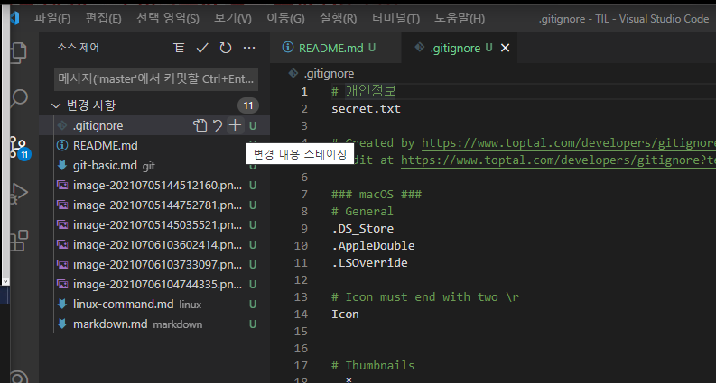

# Git - basic

git  = 폴더를 업그레이드 하는 목적

해당 폴더 아래의 (파일/폴더)를 관리하는것

git init시 폴더가 업그레이드 - 뒤에 (master)가 붙음

폴더 업그레이드 시 리포

초기화 방법 git init

rm -rf .git - 삭제

git 이라는 CCTV설치

예민해서 뭐라도 하나 바뀌면 바로 앎

처음보면 모름. 하지만 한 번이라도 그 카메라에 등록하면, 이거 이거야 이거 이제 관리해 관리 시작해 라고 말하면, 알아! 라고 함

git commit -m 'first commit' 이제는 README출력 - 사진찍는 행위 (영구히 남음) 코드가 있는 그 줄이 모두 사진 찍힘

사진을 찍기 위해서는 이메일과 이름을 등록해야함.

사진찍음 = 스탭샷 = 커밋

git log

1. init

2. add

3. commit

4. status 

5. log

터미널 화면 초기화 Ctrl + L

git add

git log --oneline 사진의 고유 번호

git checkout + 고유번호

첫번째	 워킹디렉토리/워킹트리	분장실

두번째	스테이지							촬영장

세번째	커밋/리포							결과물 모음

~

..	상위폴더

.	현재 폴더

/

## DO NOT

1. 홈 폴더를 리포로 만들기
2. 리포 안에 리포 만들기
3. github 계정명은 가능하면, 대문자 없이 깔끔하게 지을 것

나노 이넥스 빔(vim)

### 빔(vim)

i  => indert mode진입

편집(코드 입력)

편집 조료 후 `esc`를 눌러 commend모드로 돌아감

commend모드에서 `:w`로 저장 후 `:q`로 종료

`:wq`는 저장후 종료

`q!`는 강제종료

commend mode에서 `dd`는 줄 삭제

`git commit --amend` => commit 수정

깃배쉬 오류 해결 한 번만 하면 됨

https://www.toptal.com/developers/gitignore

git  add와 같다

